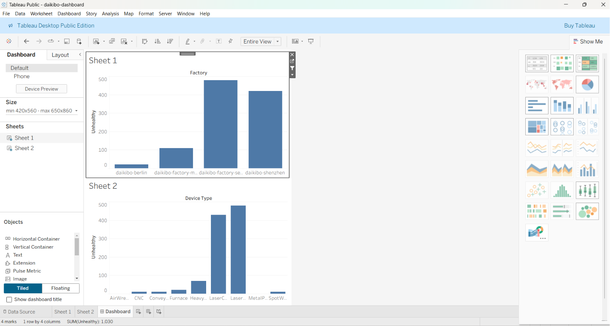
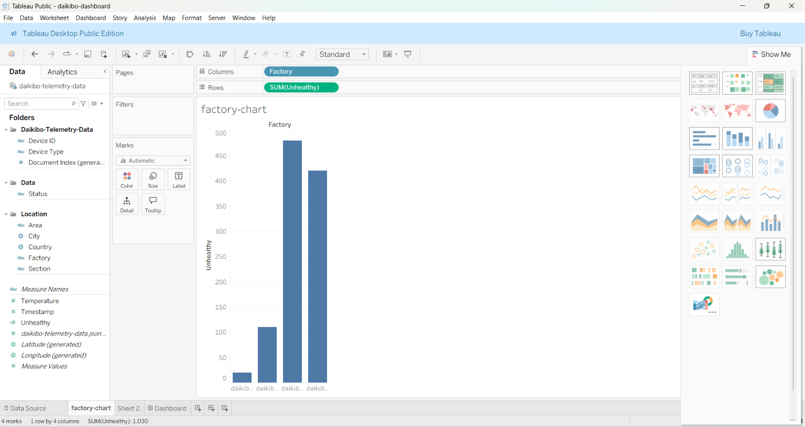
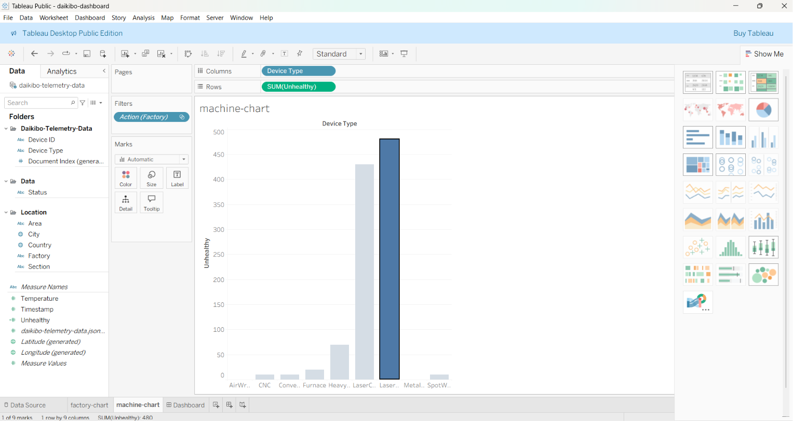

# 📊 Deloitte Australia Data Analytics Virtual Job Simulation

> **Interactive Tableau Dashboard & Forensic Technology Analysis** completed as part of the **Deloitte Australia Data Analytics Virtual Job Simulation** hosted on **Forage**.


---

# 📸 Dashboard Preview

## Interactive Tableau Dashboard



---

# 📌 Project Overview

This repository contains my completed work for the **Deloitte Australia Data Analytics Virtual Job Simulation** offered through **Forage**.

The simulation focused on solving real-world business problems using **Tableau** and **Microsoft Excel**, including:

- Building an interactive business dashboard
- Analyzing manufacturing telemetry data
- Identifying operational bottlenecks
- Investigating employee pay equality

---

# 🎯 Business Scenario

Daikibo Industrials collected telemetry data from four manufacturing factories over one month.

The goal was to analyze machine downtime and help management answer critical business questions.

Factories included:

- 🇯🇵 Daikibo Factory Meiyo (Tokyo, Japan)
- 🇯🇵 Daikibo Factory Seiko (Osaka, Japan)
- 🇩🇪 Daikibo Berlin (Germany)
- 🇨🇳 Daikibo Shenzhen (China)

---

# 📋 Tasks Completed

## ✅ Task 1 – Data Analytics

### Objective

Build an interactive Tableau dashboard to analyze telemetry data collected from multiple factories.

### Work Performed

- Imported JSON dataset into Tableau
- Created calculated fields
- Built interactive dashboards
- Applied dashboard filters
- Compared machine downtime across factories
- Identified the highest downtime location

### Business Questions Answered

✔ Which factory experienced the highest machine downtime?

✔ Which machine type contributed the most downtime?

### Findings

| Analysis | Result |
|----------|--------|
| Factory with Highest Downtime | **Daikibo Factory Seiko (Osaka, Japan)** |
| Machine with Highest Downtime | **Laser Cutter** |

---

## ✅ Task 2 – Forensic Technology

### Objective

Investigate employee compensation data to identify potential gender pay inequality.

### Work Performed

- Analyzed Equality Score data in Microsoft Excel
- Classified equality scores into:
  - Fair
  - Unfair
  - Highly Discriminative
- Completed the investigation file for submission

---

# 📊 Dashboard Features

- Factory-wise downtime analysis
- Machine-wise downtime analysis
- Interactive filtering
- Business insights
- Comparative visualization
- Executive dashboard

---

# 🛠️ Technologies Used

- Tableau Public
- Microsoft Excel
- JSON
- Data Visualization
- Dashboard Development
- Business Intelligence
- Data Analytics

---

# 📸 Screenshots

## Factory Downtime



---

## Machine Downtime



---

# 📂 Repository Structure

```
deloitte-data-analytics-job-simulation/
│
├── README.md
├── Deloitte_Australia_Data_Analytics_Certificate.pdf
├── daikibo-dashboard.twb
├── dashboard.png
├── factory-chart.png
├── machine-chart.png
└── (Task 2 Excel Solution)
```

---

# 🧠 Skills Demonstrated

- Data Analysis
- Data Visualization
- Tableau Dashboard Development
- Microsoft Excel
- Business Intelligence
- Root Cause Analysis
- Interactive Dashboard Design
- Calculated Fields
- Data Interpretation
- Problem Solving

---

# 🎓 Learning Outcomes

Through this virtual experience, I learned how to:

- Analyze manufacturing telemetry data
- Build interactive Tableau dashboards
- Create calculated fields
- Apply dashboard filters
- Generate business insights
- Interpret operational data
- Classify equality scores using Excel
- Present analytical findings effectively

---

# 🏆 Certification

Successfully completed the **Deloitte Australia Data Analytics Virtual Job Simulation** on **Forage**.

📄 **Certificate included in this repository**

---

# 📜 Virtual Experience Details

| Program | Deloitte Australia Data Analytics Virtual Job Simulation |
|----------|----------------------------------------------------------|
| Platform | Forage |
| Category | Data Analytics |
| Tools | Tableau Public, Microsoft Excel |

---

# 👩‍💻 Author

**Ronika S**

🎓 B.E. Artificial Intelligence & Data Science  
📍 Mysuru, Karnataka, India

### Connect with Me

- **GitHub:** https://github.com/Ronika08
- **LinkedIn:** https://www.linkedin.com/in/ronika-s-7647552a2/

---

# 📄 License

This project is shared for **educational and portfolio purposes only**.

The dataset and business scenario were provided as part of the **Deloitte Australia Data Analytics Virtual Job Simulation** hosted on **Forage**.

---

⭐ If you found this project useful, consider giving it a **Star**.
